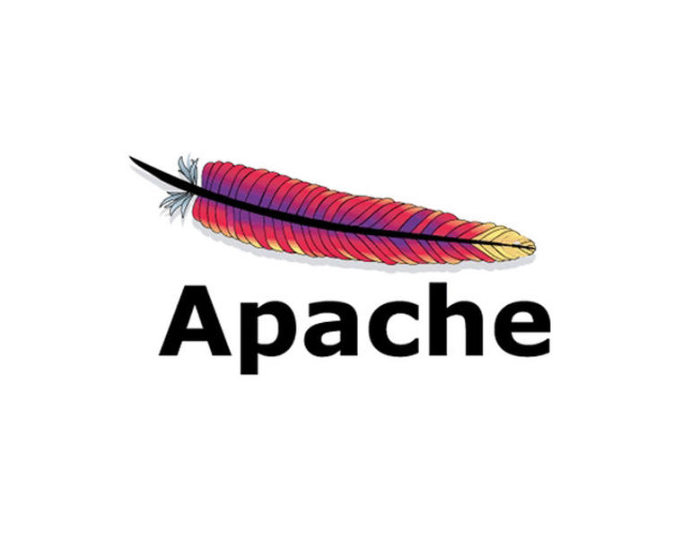

# 서버
## 내가 중요하게 볼 것
### 속도
- 게임관련 서버이므로 정보가 빨리 업데이트 되어야 함.
- 플레이어의 동작에 대한 서버의 반응이 느리면 게임이 진행되지 않으므로 속도가 가장 중요함.
### 개발 상의 편리함
- 서버 개발이 지나치게 어려우면 안됨
  - 게임 개발에 집중하기 힘듬

---
## 아파치

- NCSA HTTPd 기반
  - 팀 버너스 리
    - 인터넷 고안
    - HTTP 프로토콜 고안
- 한국 전체 등록된 도메인 중 42%가 사용
  - 점유율은 제일 높음
- 모듈
  - 여러가지 기능을 설치 가능
  - PHP
  - MySQL
    - 아파치, PHP, MySQL을 묶어 APM이라고도 부름
