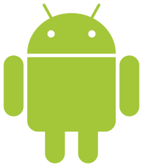

# 클라이언트
## 내가 중요하게 볼 것
### 점유율
- 클라이언트 자체의 점유율이 이미 부족하다면, 게임의 점유율 또한 높아지기 힘듬
- 게임의 성공에는 점유율 또한 주요하므로 클라이언트의 점유율도 중요
### 호환성
- 다양한 기기에서 사용 가능하면 좋음
- 다양한 사람에게 게임을 제공할 수 있기 때문.
---
## 안드로이드

- 구글
  - 세계 1위 검색엔진 보유 회사
- 모바일 클라이언트 점유율 1위
  - 86%
- 버전
  - 버전마다 이름을 붙임
    - Android 1.0
    - Banana Bread
    - Cupcake
    - Donut
    - Eclair
    - Frozen yogurt
    - Gingerbread
    - Honeycomb
    - Ice Cream Sandwich
    - Jelly Bean
    - KitKat
    - Lollipop
    - Marshmallow
    - Nougat
    - Oreo
    - Pie
  - 이름은 모두 디저트 이름
  - 각 알파벳 순으로 지어지는 형식
- 세계 스마트폰 점유율 1위 삼성, 2위 화웨이
  - 해당 회사의 스마트폰이 안드로이드를 사용
  - 호환성도 높음
- 프로그래밍 언어
  - Java
- 개발 툴
  - Eclipse
  - Android Studio
  - 구글에서 스탠다드 개발 툴을 지정
    - 현재는 Android Studio
## Apple iOS

- 애플
  - 아이폰
  - 아이패드
  - 아이팟
- 모바일 클라이언트 점유율 2위
  - 안드로이드와 합치면 약 100%에 육박
- 애플社 전용 클라이언트
  - 적은 사용자 및 호환성
  - 상대적으로 좋은 성능
    - iOS 독점게임도 있음
## Windows Phone
![Windows Phone]
